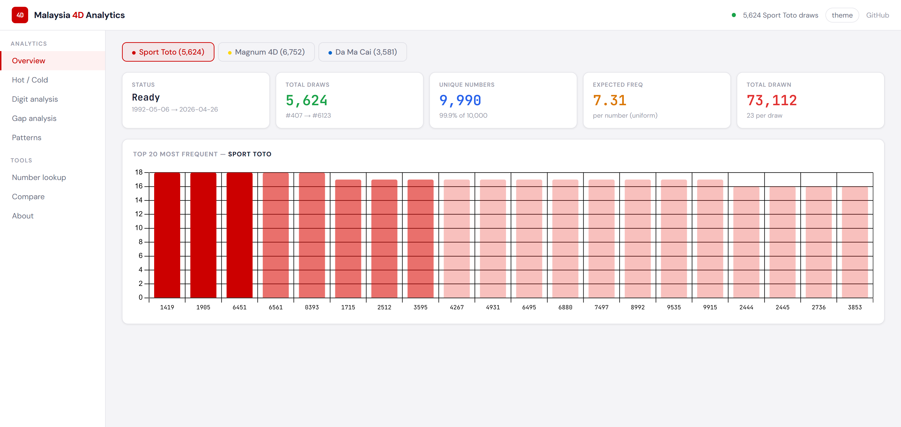

# malaysia-4d


**[Live Dashboard](https://deadboy18.github.io/malaysia-4d/)** | [Documentation](#table-of-contents)



Historical draw data and statistical analysis for Malaysia's three major 4D lottery operators: **Sport Toto**, **Magnum 4D**, and **Da Ma Cai**.

Scrapers that collect publicly available draw results, a Flask-based analytics API, and an interactive dashboard for exploring the data. Over **15,900 draws** and **367,000 winning numbers** spanning four decades — the most complete publicly available 4D dataset for Malaysia.

---

## Table of contents

1. [The data](#the-data)
2. [What is 4D?](#what-is-4d)
3. [How it works — step by step](#how-it-works--step-by-step)
4. [Big vs Small — the two bet types](#big-vs-small--the-two-bet-types)
5. [Prize tables](#prize-tables)
6. [What would you actually win?](#what-would-you-actually-win)
7. [Who runs this — the operators](#who-runs-this--the-operators)
8. [Is it legal?](#is-it-legal)
9. [Draw schedule](#draw-schedule)
10. [How draws are conducted — the machines](#how-draws-are-conducted--the-machines)
11. [Why prediction is impossible](#why-prediction-is-impossible)
12. [Why bomoh, feng shui, and dream books don't work either](#why-bomoh-feng-shui-and-dream-books-dont-work-either)
13. [The mathematics of expected value](#the-mathematics-of-expected-value)
14. [Dashboard](#dashboard)
15. [Running locally](#running-locally)
16. [Updating the data](#updating-the-data)
17. [API](#api)
18. [Project structure](#project-structure)
19. [Jupyter notebook](#jupyter-notebook)
20. [Data sources and methodology](#data-sources-and-methodology)
21. [Historical timeline](#historical-timeline)
22. [References](#references)
23. [Legal and responsible use](#legal-and-responsible-use)
24. [License](#license)

---

## The data

All data is in the `data/` folder as CSV files, updated to **26 April 2026**.

| Operator | File | Draws | Date range | Source |
|----------|------|------:|------------|--------|
| Sport Toto | `sportstoto_draws.csv` | 5,624 | May 1992 — Apr 2026 | sportstoto.com.my |
| Magnum 4D | `magnum_draws.csv` | 6,752 | Apr 1985 — Apr 2026 | magnum4d.my |
| Da Ma Cai | `damacai_draws.csv` | 3,581 | Jan 2005 — Apr 2026 | damacai.com.my |

Each row is one draw. Columns: `draw_seq`, `date`, `year`, `month`, `day`, `prize_1`, `prize_2`, `prize_3`, `special_1`–`special_10`, `consol_1`–`consol_10` — that's 23 winning numbers per draw.

You don't need to run any code to use the data. The CSVs work in Excel, Google Sheets, pandas, R, or anything else that reads CSV.

---

## What is 4D?

4-Digits (4D) is a fixed-odds lottery game played in Malaysia, Singapore, Germany, Taiwan, and Cambodia. It is similar to "Pick 4" in the United States and Canada.

The concept is simple: you choose any four-digit number from **0000 to 9999** (that's 10,000 possible numbers). Each draw, the operator draws **23 winning numbers** using mechanical machines in front of a live audience. If your number matches any of the 23, you win a cash prize. The amount you win depends on which category your number was drawn in and whether you placed a "Big" or "Small" bet.

The game is a **fixed-odds** system, meaning payouts are predetermined multipliers of your bet amount — they don't change based on how many people bet on the same number. This is different from lottery jackpots (like Toto 6/58) where the prize pool is shared among winners.

There are 10,000 possible numbers. Each draw picks 23 of them. So in any single draw, the probability of your specific number being one of the 23 winners is **23/10,000 = 0.23%**, or roughly **1 in 435**. But you don't win the same amount for all 23 — the top 3 prizes pay significantly more than the 10 Special and 10 Consolation prizes.

---

## How it works — step by step

1. **Pick a number.** Any four digits from 0000 to 9999. It can be your birthday, your car plate, a random choice, or anything.

2. **Choose your bet type.** Either "Big" (ABC) or "Small" (A), or both. Big gives you 23 chances to win (lower payouts). Small gives you only 3 chances to win (higher payouts). More on this below.

3. **Place your bet.** Minimum bet is **RM1** per number per bet type. You can bet any amount in RM1 increments. You can bet on multiple numbers on the same ticket.

4. **Wait for the draw.** Draws happen on Wednesdays, Saturdays, and Sundays at **7:00 PM MYT** (Malaysian Time, GMT+8). Occasional special draws happen on Tuesdays.

5. **Check the results.** 23 numbers are drawn: 1st Prize, 2nd Prize, 3rd Prize, 10 Special prizes (also called Starter prizes), and 10 Consolation prizes. If your number matches any of these, you win.

6. **Claim your prize.** Winners have **180 days** (6 months minus 1 day) from the draw date to claim. Prizes up to RM2,000 can be claimed at any outlet. Larger prizes must be claimed at the operator's head office or regional offices.

---

## Big vs Small — the two bet types

This is the core mechanic that every 4D player needs to understand.

**Big (ABC):** Your number can win against all 23 drawn numbers — 1st, 2nd, 3rd, 10 Special, and 10 Consolation. More chances to win, but the payouts are lower.

**Small (A):** Your number can only win against the top 3 — 1st, 2nd, or 3rd prize. Only 3 chances to win, but the payouts are significantly higher.

You can place both Big and Small bets on the same number on the same ticket. Many players do exactly this.

---

## Prize tables

These are the standard payouts for all three major operators (Magnum, Sport Toto, Da Ma Cai) — the prize structure is identical across operators for the basic 4D game.

### Standard 4D — per RM1 bet

| Prize category | Big (ABC) | Small (A) |
|---------------|----------:|----------:|
| 1st Prize | RM 2,500 | RM 3,500 |
| 2nd Prize | RM 1,000 | RM 2,000 |
| 3rd Prize | RM 500 | RM 1,000 |
| Special (x10) | RM 180 | — |
| Consolation (x10) | RM 60 | — |

Small bets do not participate in Special or Consolation categories at all. If your number comes up as a Special or Consolation winner, a Small bet on that number wins nothing.

### Other bet types

**iBet / mBox / iPerm** — a permutation bet. Instead of matching the exact digit order, you win if any rearrangement of your digits matches. For example, betting "1234" as iPerm 24 covers all 24 permutations (1234, 1243, 1324, ..., 4321). The payout is divided by the number of permutations.

| iPerm Big (per RM1) | 24 Perms | 12 Perms | 6 Perms | 4 Perms |
|---------------------|-------:|-------:|------:|------:|
| 1st Prize | RM 105 | RM 209 | RM 417 | RM 625 |
| 2nd Prize | RM 42 | RM 84 | RM 167 | RM 250 |
| 3rd Prize | RM 21 | RM 42 | RM 84 | RM 125 |
| Special | RM 8 | RM 15 | RM 30 | RM 45 |
| Consolation | RM 3 | RM 5 | RM 10 | RM 15 |

The number of permutations depends on how many repeated digits your number has. A number with 4 unique digits (like 1234) has 24 permutations. A number with one pair (like 1123) has 12. Two pairs (like 1122) has 6. Three of a kind (like 1112) has 4.

**4D Roll** — you choose 3 of the 4 digits and one position is a wildcard ("R") covering 0–9. This means you're buying 10 straight bets. Minimum bet is RM10.

**Quick Pick** — the terminal randomly generates a number for you. Statistically identical to choosing your own number.

---

## What would you actually win?

Here's what different bet amounts would pay out if your number hits, using the standard 4D game:

### Big bet — your number is drawn as 1st Prize

| Bet amount | Payout |
|-----------:|-------:|
| RM 1 | RM 2,500 |
| RM 10 | RM 25,000 |
| RM 100 | RM 250,000 |
| RM 1,000 | RM 2,500,000 |
| RM 10,000 | RM 25,000,000 |

### Small bet — your number is drawn as 1st Prize

| Bet amount | Payout |
|-----------:|-------:|
| RM 1 | RM 3,500 |
| RM 10 | RM 35,000 |
| RM 100 | RM 350,000 |
| RM 1,000 | RM 3,500,000 |
| RM 10,000 | RM 35,000,000 |

### Big bet — your number is drawn as Consolation (lowest tier)

| Bet amount | Payout |
|-----------:|-------:|
| RM 1 | RM 60 |
| RM 10 | RM 600 |
| RM 100 | RM 6,000 |
| RM 1,000 | RM 60,000 |

### Example: RM2 Big + RM1 Small on number 5238

Suppose you bet RM2 Big and RM1 Small on number 5238, and it is drawn as 1st Prize:

- Big payout: RM 2,500 x 2 = **RM 5,000**
- Small payout: RM 3,500 x 1 = **RM 3,500**
- **Total: RM 8,500** on a RM3 ticket

If 5238 is drawn as a Special prize instead: Big payout is RM 180 x 2 = RM 360, Small payout is RM 0 (Small doesn't cover Special). Total: RM 360.

If 5238 is drawn as Consolation: Big payout is RM 60 x 2 = RM 120, Small payout is RM 0. Total: RM 120.

If 5238 is not drawn at all: you lose RM 3.

---

## Who runs this — the operators

4D in Malaysia is operated by **Number Forecast Operators (NFOs)** — private companies licensed by the Malaysian government under the Ministry of Finance. They are regulated under the **Pool Betting Act 1967** and the **Betting Act 1953**.

### Magnum 4D

- **Company:** Magnum Corporation Sdn Bhd, a 100% subsidiary of **Magnum Berhad** (listed on Bursa Malaysia, KLSE)
- **Founded:** Incorporated 18 August 1975. Listed on KLSE since 11 January 1982.
- **Status:** First company to receive a 4D operator license from the Malaysian government.
- **Certifications:** World Lottery Association (WLA) Level 2 Responsible Gaming certification. First lottery company in Asia to hold both WLA Security Control Standard and ISO/IEC 27001 certifications.
- **Draw venue:** Magnum House, 111 Jalan Pudu, Kuala Lumpur (public can attend)
- **Games:** 4D, Magnum Life, 4D Jackpot, 4D Jackpot Gold
- **Website:** [magnum4d.my](https://www.magnum4d.my/)

### Sport Toto

- **Company:** STM Lottery Sdn Bhd, a wholly owned subsidiary of **Sports Toto Berhad** (listed on Bursa Malaysia as SPTOTO, MYX: 1562), which is part of the **Berjaya Group** founded by Tan Sri Vincent Tan.
- **Founded:** Incorporated by the Malaysian government in 1969 to raise funds for sports, youth, and cultural activities. Privatised on 1 August 1985 in a non-tender privatisation to Vincent Tan.
- **Status:** Largest NFO in Malaysia by outlet count (~680 sales outlets) and number of game products.
- **Draw venue:** Level 13, Berjaya Times Square, Kuala Lumpur (public can attend; non-Muslim, 21+ only)
- **Draw time:** 7:00 PM sharp
- **Games:** Toto 4D, 4D Jackpot, 4D Zodiac, Toto 5D, Toto 6D, Star Toto 6/50, Power Toto 6/55, Supreme Toto 6/58
- **Record jackpot:** RM121.7 million (the largest in Malaysian history)
- **Website:** [sportstoto.com.my](https://www.sportstoto.com.my/)

### Da Ma Cai (大马彩)

- **Company:** Pan Malaysian Pools Sdn Bhd
- **Founded:** 1988. Originally controlled by Tanjong plc (owned by tycoon T. Ananda Krishnan). In 2011, to make Tanjong plc syariah-compliant for Middle Eastern markets, the gaming business was sold to **Jana Pendidikan Malaysia Sdn Bhd (JPM)**, which pledged all profits to the **Community Chest** — a fund established to promote and support education in Malaysia.
- **Status:** Unlike Magnum and Sport Toto, Da Ma Cai is now a **non-profit organisation**. All profits are channeled to education — funding learning institutions and providing scholarships for financially disadvantaged Malaysian students.
- **Name:** "Da Ma Cai" (大马彩) literally means "Pan-Malaysia Lottery" in Mandarin.
- **Games:** 1+3D, 3D, 1+3D Jackpot, Da Ma Cai Jackpot (launched January 2014, minimum Jackpot 1 payout of RM1.8 million)
- **Mobile:** dmcGO app (iOS and Android) launched December 2016
- **Website:** [damacai.com.my](https://www.damacai.com.my/)

### WTL-M (Daily Derby)

A fourth, newer operator offering Daily Derby 4D Blue, Derby Green, and 5D Jackpots. Not covered in this repository's data collection.

---

## Is it legal?

**Yes, with conditions.** 4D is legal in Malaysia under federal law. The three major operators hold licenses issued by the Ministry of Finance under the Pool Betting Act 1967. Draws are conducted under government oversight with regulatory compliance requirements.

However, there are restrictions:

- **Minimum age:** 21 years old to purchase tickets or attend draws.
- **Religious restriction:** Non-Muslims only. Under Malaysian law, Muslims are prohibited from gambling. 4D outlets do not sell tickets to Muslims, and draw venues restrict entry to non-Muslims.
- **State-level bans:** Some states governed by PAS (the Islamic party) have banned physical lottery outlets. Kelantan banned them in 1990, Terengganu in 2020, Kedah in 2023 (though the Alor Setar High Court ruled the Kedah ban unconstitutional in July 2024, affirming that lottery regulation falls under federal, not state, jurisdiction). Perlis also moved to close outlets. The legal position continues to evolve.
- **Underground operators** are illegal. Only licensed NFOs may operate 4D games. Unlicensed syndicates face criminal prosecution.

**Taxation:** NFO winnings are not taxed for the player in Malaysia. The operators pay gaming tax, pool betting duty, and other levies to the government.

---

## Draw schedule

| Day | Draw |
|-----|------|
| Wednesday | Regular draw |
| Saturday | Regular draw |
| Sunday | Regular draw |
| Tuesday | Special draw (occasional, pre-announced) |

All draws at **7:00 PM MYT (GMT+8)**. All three operators draw on the same days. Results are typically published on the operators' websites within minutes of the draw concluding.

Special draw dates are announced in advance by the operators (typically 4–6 special draws per year).

---

## How draws are conducted — the machines

This is the critical part for understanding why the numbers are random. All three operators use **physical mechanical machines** with **no computer involvement** in number selection. Draws are conducted in **public view** with **members of the public** operating the machines.

### Magnum 4D

Draws at Magnum House, 111 Jalan Pudu, Kuala Lumpur. Three members of the public are randomly selected before each draw.

The machine: four transparent electromechanical drums, each containing 10 numbered balls (digits 0–9). The drums are see-through and remotely controlled — no human hands touch the drums or balls during the draw.

Process:
1. An emcee instructs the randomly selected participants.
2. A participant presses a remote control button.
3. The four drums activate simultaneously. Each drum spins its 10 balls and mechanically captures one, forming a four-digit winning number.
4. The first participant draws 8 numbers, the second draws 8, the third draws 7 — totaling 23 numbers.
5. These 23 numbers are initially all "Special" prizes. To determine 1st, 2nd, and 3rd prize, a separate drum containing 13 lettered balls (A–M) is drawn three times. The letters map to the 13 Special numbers, selecting which three become the top prizes.

Magnum's stated position: *"The draw is conducted using purely mechanical means, with no computers involved. Our players can have complete confidence that our winning numbers are determined completely by chance and the draw itself cannot be manipulated, hacked or tampered with in any way whatsoever."*

### Sport Toto

Draws at Level 13, Berjaya Times Square, Kuala Lumpur. Five members of the public are selected as drawees (must be non-Muslim, 21+, good standing).

The machine: pneumatic draw machines with transparent tubes, transparent chambers, and transparent body — every part of the machine is visible.

Process:
1. Drawees select which marble bags will be used (adding another layer of randomness).
2. Marbles are loaded into the machines in view of the audience.
3. Drawees activate the machines. Pneumatic pressure mixes the balls and ejects one per tube.
4. The entire loading, mixing, and selection process is visible through the transparent machine.
5. Proceedings are recorded for audit.
6. Draw order: Lotto games first (6/50, 6/55, 6/58), then digit games (6D, 5D, 4D, 4D Jackpot, 4D Zodiac).

A Panel of Judges (also public members) oversees and officiates the draw.

### Da Ma Cai

Five electromechanically operated drums, open to the public.

Four drums (marked 1+, 2, 3, 4) each contain 10 balls numbered 0–9 and produce the four-digit numbers. A fifth drum (marked H) contains balls corresponding to horses in a designated race.

Process:
1. Ten consolation numbers are drawn first.
2. Thirteen four-digit numbers are drawn next. Each is simultaneously assigned to a horse from the H drum.
3. Main prizes (1st, 2nd, 3rd) are determined by the results of the actual designated horse race — whichever horses finish 1st, 2nd, 3rd, their assigned numbers become the main prizes.
4. Remaining numbers become Special/Starter prizes.

This is the most unique mechanism — Da Ma Cai's main prizes are ultimately determined by a horse race, adding yet another layer of physical randomness that no human or computer can control.

---

## Why prediction is impossible

The internet is full of "4D prediction" websites, apps, and services that charge money for "winning formulas." They are all, without exception, fraudulent or deluded. Here is the mathematical and physical reality.

### The physics

Each winning number is produced by four independent mechanical drums, each containing 10 equally weighted balls. The ball selected by each drum is determined by chaotic mechanical interactions — collisions between balls, air turbulence (in pneumatic machines), the precise moment of drum activation, microscopic variations in ball surfaces, and gravity. These are deterministic systems in theory, but the sensitivity to initial conditions is so extreme that they function as truly random number generators in practice.

This is the same principle behind every casino, lottery, and random drawing system in the world. The physics of bouncing balls in a confined space is a textbook example of a chaotic system — one where infinitesimally small differences in starting conditions lead to completely different outcomes.

### The mathematics

Each draw is **independent**. The balls in the drum have no memory. They don't know what number was drawn last week or ten years ago. The outcome of draw #6,000 has exactly zero relationship to draw #5,999 or any prior draw.

When people analyse historical data and find that number 1234 appeared 8 times while 5678 appeared 3 times, they are observing **normal statistical variance** — the expected behaviour of random sampling. If you flip a fair coin 100 times, you won't get exactly 50 heads and 50 tails every time. You might get 55-45 or 42-58. That doesn't mean the coin is biased or that you can predict the next flip.

**The gambler's fallacy:** The belief that a number is "due" because it hasn't appeared recently. This is false. If number 7777 hasn't appeared in 500 draws, the probability of it appearing in the next draw is still exactly the same as every other number — approximately 0.23%. Past draws do not influence future draws.

**Frequency analysis:** Some people track "hot numbers" (drawn often) and "cold numbers" (drawn rarely). Over thousands of draws, all numbers converge toward the same frequency. The deviations visible in any finite dataset are exactly what randomness looks like. The Jupyter notebook in this repository runs chi-square goodness-of-fit tests on the actual data and confirms that the draws are statistically consistent with uniform random selection.

### What about AI and machine learning?

AI and machine learning work by finding patterns in data. They are extraordinarily powerful when patterns exist — in language, images, stock trends, weather systems. But 4D draw data contains **no pattern to find**, because each draw is generated by an independent physical random process. Training a neural network on 4D data is like training it to predict fair coin flips. It will achieve exactly 50% accuracy on coin flips, and exactly random performance on 4D numbers, because there is no signal in the data — only noise.

Any AI system that claims to predict 4D numbers is either a scam or the result of someone who doesn't understand what their model is actually learning (which is: nothing).

---

## Why bomoh, feng shui, and dream books don't work either

This section is specific to the cultural context of 4D in Malaysia and Singapore, where supernatural prediction methods are widely marketed.

**Bomoh (traditional Malay shamans):** Some bomoh claim they can commune with spirits, perform rituals at cemeteries (including the well-known practice of "selling salt to spirits" to receive lucky numbers), or use supernatural means to foresee winning numbers. These practices are rooted in cultural belief systems, but they have no mechanism to influence or predict the outcome of a mechanical drum containing 10 balls bouncing in a transparent chamber. The balls are physical objects obeying the laws of physics. No metaphysical practice changes the trajectory of a rubber ball in a spinning drum.

**Feng shui and numerology:** Some practitioners assign meaning to numbers based on Chinese numerological traditions (8 sounds like "prosper" in Mandarin, 4 sounds like "death", etc.). While these frameworks have deep cultural significance, they describe human associations with numbers, not the behaviour of physical lottery machines. The drum doesn't know that 8 sounds like 发 (fā). Every ball weighs the same and has the same probability of being captured.

**Dream books (Buku Mimpi):** A popular tradition where specific dream images correspond to specific numbers. Dreaming of a snake might correspond to number 32, for example. These books are widely sold in Malaysia and Singapore. They are cultural artifacts with a long history, but dreams are generated by the dreamer's brain, not by the lottery machine. There is no causal mechanism connecting the content of a dream to the state of a mechanical drum several days later.

**Why do people believe these work?** Because of **confirmation bias** and **survivorship bias**. When someone follows a ritual and wins, they tell everyone. When they follow the same ritual and lose (which happens the vast majority of the time), they don't. Over millions of players and thousands of draws, some people will win after visiting a bomoh or consulting a dream book — not because those methods work, but because some people will always win, and those who happened to use a method will attribute their win to it.

If any of these methods actually worked, the practitioners would be billionaires. They are not. They make their money selling the method, not using it.

---

## The mathematics of expected value

For anyone who wants to understand the house edge quantitatively.

In a single draw, 23 numbers are drawn from 10,000 possible. For a RM1 Big bet on a single number:

| Outcome | Probability | Payout | Expected value |
|---------|------------|--------|---------------|
| 1st Prize | 1/10,000 | RM 2,500 | RM 0.2500 |
| 2nd Prize | 1/10,000 | RM 1,000 | RM 0.1000 |
| 3rd Prize | 1/10,000 | RM 500 | RM 0.0500 |
| Special (any of 10) | 10/10,000 | RM 180 | RM 0.1800 |
| Consolation (any of 10) | 10/10,000 | RM 60 | RM 0.0600 |
| No win | 9,977/10,000 | RM 0 | RM 0.0000 |
| **Total expected return** | | | **RM 0.6400** |

For every RM1 you bet Big, you get back **RM0.64 on average**. The house takes **36 sen per ringgit**, or a **36% house edge**.

For a RM1 Small bet:

| Outcome | Probability | Payout | Expected value |
|---------|------------|--------|---------------|
| 1st Prize | 1/10,000 | RM 3,500 | RM 0.3500 |
| 2nd Prize | 1/10,000 | RM 2,000 | RM 0.2000 |
| 3rd Prize | 1/10,000 | RM 1,000 | RM 0.1000 |
| **Total expected return** | | | **RM 0.6500** |

The Small bet returns RM0.65 per RM1, for a **35% house edge**.

Both bets lose money in the long run. There is no bet type, strategy, or number selection method that makes 4D a positive expected-value game. The operators make money because the total amount paid out in prizes is always less than the total amount bet.

---

## Dashboard

The dashboard is a single HTML file (`dashboard.html`) served by the Flask backend.

**Analysis views:**
- **Overview** — dataset stats, draw counts, date ranges, number coverage per operator
- **Hot/Cold numbers** — frequency rankings filterable by prize tier (1st, 2nd, 3rd, Special, Consolation, All)
- **Digit positions** — how often each digit (0–9) appears in each of the four positions
- **Gap analysis** — how many draws since each number last appeared, median/mean gap, overdue counts
- **Number lookup** — search any 4-digit number to see its full appearance history across all tiers
- **Patterns** — distribution of number structures (palindromes, ascending, descending, quads, two-digit, three-digit, all-different)
- **Weekday analysis** — top numbers by day of the week
- **Cross-operator comparison** — side-by-side stats across all three operators

**Tools:**
- **Scraper controls** — run scrapers from the UI with live progress log
- **CSV export** — download raw data per operator

Light and dark theme. JetBrains Mono for numbers, DM Sans for text.

---

## Running locally

```bash
pip install -r requirements.txt
python server.py
# Open http://localhost:8080
```

On Windows, double-click `START.bat` — it checks Python, installs packages if needed, starts the server, and opens the browser.

**Requirements:** Python 3.8+, Flask, pandas, numpy, requests, beautifulsoup4.

---

## Updating the data

### From the dashboard

Click the **Scraper** tab, select an operator, choose a year range or click "Update" to fetch only draws newer than the last entry in the CSV.

### From the command line

```bash
# Sport Toto — full scrape from a given year (~2 min/year)
python scraper_sportstoto.py --from 1992

# Sport Toto — only new draws since last CSV entry
python scraper_sportstoto.py --update

# Magnum 4D
python scraper_magnum.py --all
python scraper_magnum.py --update

# Da Ma Cai
python scraper_damacai.py --all
python scraper_damacai.py --update
```

Scrapers are rate-limited (0.4–1s delay between requests). Sport Toto is scraped via HTML parsing. Magnum and Da Ma Cai use their respective JSON APIs.

---

## API

All endpoints return JSON. Operator prefix: `sportstoto`, `magnum`, or `damacai`.

| Method | Endpoint | Description |
|--------|----------|-------------|
| GET | `/api/operators` | List all operators with data status |
| GET | `/api/{op}/status` | Dataset stats (draws, unique numbers, coverage, date range) |
| GET | `/api/{op}/frequency?tier=` | Hot/cold number rankings, filterable by prize tier |
| GET | `/api/{op}/digits` | Digit frequency per position (4 x 10 matrix) |
| GET | `/api/{op}/gaps` | Gap analysis — overdue numbers, median/mean gap |
| GET | `/api/{op}/lookup?num=1234` | Full history of a specific number |
| GET | `/api/{op}/patterns` | Pattern distribution and weekday breakdown |
| GET | `/api/compare` | Cross-operator comparison |
| GET | `/api/{op}/export` | Download raw CSV |
| POST | `/api/scrape` | Start a scraper (`{operator, from_year, to_year, update}`) |
| GET | `/api/scrape/status` | Scraper progress and log |

---

## Project structure

```
malaysia-4d/
  server.py                Flask API and analytics engine
  dashboard.html           Single-page dashboard (HTML/CSS/JS)
  analysis.ipynb           Jupyter notebook — statistical deep-dive
  build.py                 Build utility (Windows distributable)
  fix_magnum.py            Data cleanup script for Magnum CSV
  requirements.txt         Python dependencies
  START.bat                Windows quick-start launcher
  data/
    sportstoto_draws.csv   Sport Toto: 5,624 draws (1992–2026)
    magnum_draws.csv       Magnum 4D: 6,752 draws (1985–2026)
    damacai_draws.csv      Da Ma Cai: 3,581 draws (2005–2026)
  scraper_sportstoto.py    Sport Toto scraper (HTML)
  scraper_magnum.py        Magnum 4D scraper (JSON API)
  scraper_damacai.py       Da Ma Cai scraper (JSON API)
```

---

## Jupyter notebook

`analysis.ipynb` is a standalone statistical analysis of the dataset:

1. Data validation and integrity checks
2. Draw calendar and frequency over time
3. Hot/cold number rankings with confidence intervals
4. Digit-position frequency analysis
5. Gap analysis and overdue number distributions
6. Prize tier patterns over time
7. Number pair co-occurrence
8. Day-of-week statistical breakdowns
9. Randomness verification (chi-square tests, entropy measurements)
10. Key statistical takeaways

Works directly with the included CSV data, no scraping needed.

---

## Data sources and methodology

All draw results are scraped from the operators' official public websites. These are publicly posted results that anyone can look up. No authentication, paywalls, or terms-of-service violations are involved.

The scrapers parse published results and normalize them into a consistent CSV schema. Each draw produces exactly 23 winning numbers (3 main prizes + 10 special + 10 consolation). Early Sport Toto draws (pre-2000) did not publish consolation numbers, so those fields are empty for older records.

No data is fabricated, interpolated, or modified. What the operator published is what appears in the CSV.

---

## Historical timeline

| Year | Event |
|------|-------|
| ~1951 | 4D betting originates in Kedah, Malaysia — a schoolboy raffles his bicycle using numbered tickets matched against horse racing sweepstakes, spawning 2D, 3D, then 4D |
| 1966 | Singapore Turf Club introduces 4D draws in Singapore (S$2,000 first prize for a $1 ticket) |
| 1967 | Pool Betting Act 1967 enacted in Malaysia, providing the legal framework for licensed number forecast operators |
| 1969 | Sports Toto Malaysia incorporated by the Malaysian government to fund sports and cultural activities |
| 1975 | Magnum Corporation incorporated. Becomes the first company licensed to operate 4D in Malaysia |
| 1982 | Magnum Berhad listed on Kuala Lumpur Stock Exchange (KLSE) |
| 1985 | Malaysian government privatises Sports Toto to Vincent Tan / Berjaya Group |
| 1986 | Singapore Pools launches computerised 4D betting. First draw's winning number: 8838 (8 sounds like "prosper" in Mandarin) |
| 1988 | Pan Malaysian Pools (Da Ma Cai) begins 1+3D operations |
| 2004 | Singapore Turf Club stops offering 4D (Singapore Pools takes over all draws) |
| 2009 | Magnum launches 4D Jackpot — a parimutuel extension of 4D |
| 2011 | Da Ma Cai restructured as non-profit. All profits channeled to Community Chest for education |
| 2014 | Da Ma Cai Jackpot launched (minimum Jackpot 1 payout: RM1.8 million) |
| 2016 | Da Ma Cai launches dmcGO mobile app |
| Present | Draws on Wed/Sat/Sun with occasional special Tuesday draws. Four licensed NFOs in Malaysia: Sport Toto, Magnum, Da Ma Cai, and WTL-M (Daily Derby). Sport Toto holds the record for Malaysia's largest jackpot at RM121.7 million |

---

## References

- [How 4D winning numbers are drawn](https://www.4dkingdom.com/how-4d-drawn) — 4D Kingdom
- [How are draws conducted?](https://support.magnum4d.my/hc/en-us/articles/360004166235-How-are-draws-conducted) — Magnum 4D official support
- [About 4D operators](https://www.4dkingdom.com/about-4d-operator) — 4D Kingdom
- [4-Digits](https://en.wikipedia.org/wiki/4-Digits) — Wikipedia
- [Sports Toto](https://en.wikipedia.org/wiki/Sports_Toto) — Wikipedia
- [Pool Betting Act 1967](https://www.federalgazette.agc.gov.my/) — Malaysian federal legislation
- [sportstoto.com.my](https://www.sportstoto.com.my/) — Sport Toto official site
- [magnum4d.my](https://www.magnum4d.my/) — Magnum 4D official site
- [damacai.com.my](https://www.damacai.com.my/) — Da Ma Cai official site
- [4D prize structure](https://gd4d.co/en/prize-structure) — GD4D (aggregated prize tables)

---

## Legal and responsible use

This repository is for educational and analytical purposes. The data consists of publicly available historical draw results.

4D is a form of gambling. If you play, play responsibly and only with money you can afford to lose. The expected value of a 4D ticket is negative — the house always wins in aggregate. As shown in the expected value section above, you lose approximately 35–36 sen on every RM1 bet in the long run. Statistical analysis of past results does not and mathematically cannot improve your odds of winning future draws.

If you or someone you know has a gambling problem, contact the **National Council on Problem Gambling** or seek professional help.

---

## License

MIT — see [LICENSE](LICENSE).
